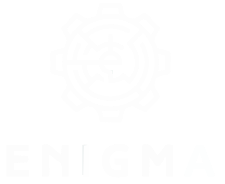
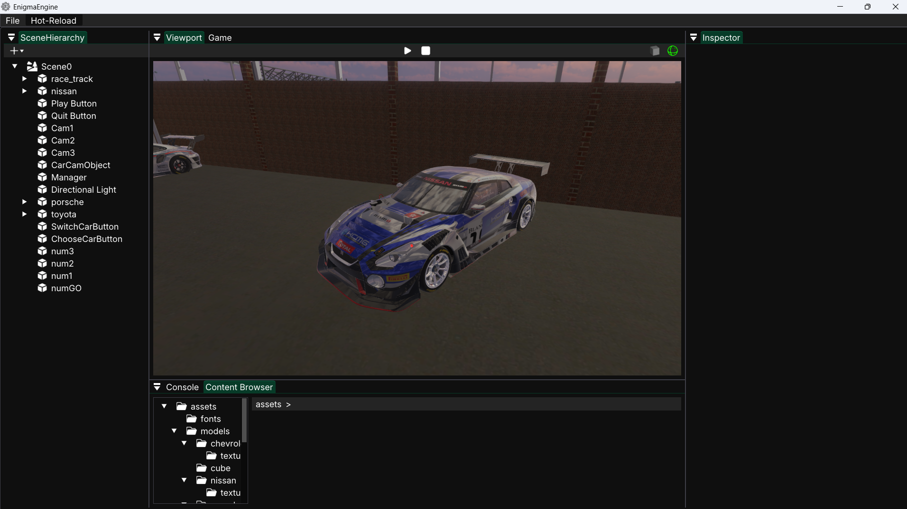
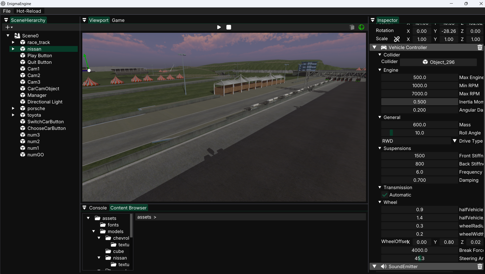
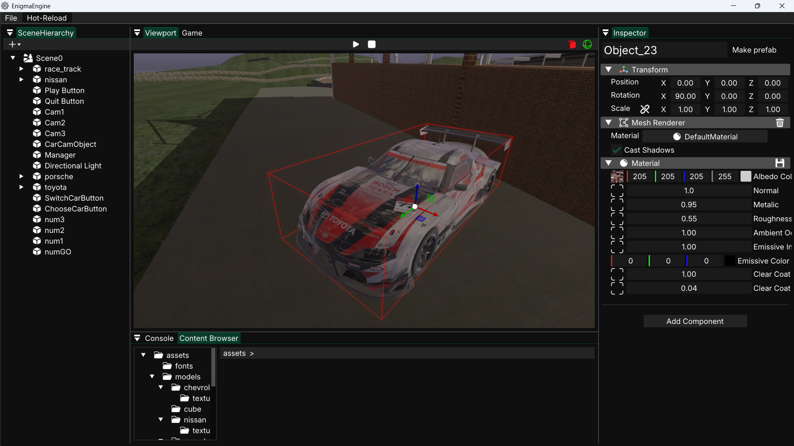
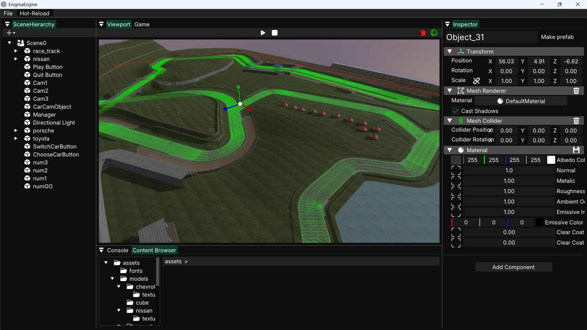
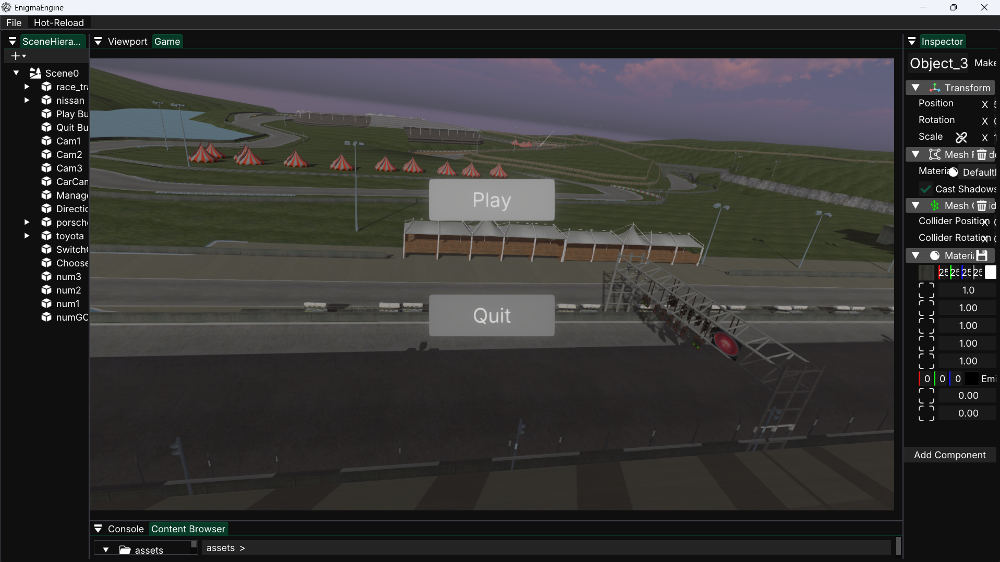
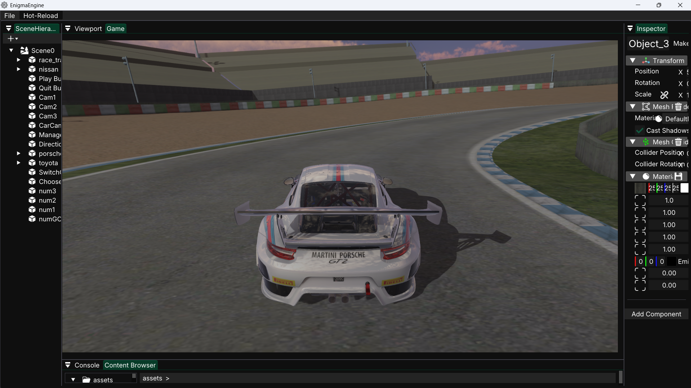

# Enigma Engine

    

## 🎯 Description

**Enigma Engine** is a custom 3D engine written in C++ with an OpenGL rendering backend and a custom RHI abstraction layer. It features an advanced rendering pipeline as well as a physics system powered by Jolt Physics. The architecture is based on a reflective **entity-component system**, all controlled by an ImGui editor.

## <ins>TABLE OF CONTENTS:</ins>
* [Description](#-description)
* [Project Objectives](#-project-objectives)
* [Implemented Features](#-implemented-features)
* [Inputs](#-inputs)
* [ScreenShots](#-screenshots)
* [Technical Details](#-technical-details)
* [Credits](#-credits)

## 🧠 Project Objectives

designed for developing racing car games
**Enigma Engine** aims to focus on developping an engine able to making car games. This allows us to build on all the skills we have acquired : C++, architecture, graphics, multithreading, ...

## ✅ Implemented Features

- **Window** : [GLFW](https://github.com/glfw/glfw)

- **Load Mesh** : [assimp](https://github.com/assimp/assimp)
- **Load Texture** : [stb_image](https://github.com/nothings/stb)
- **Physics** : [JoltPhysics](https://github.com/jrouwe/JoltPhysics)
- **UI** : [ImGui](https://github.com/ocornut/imgui) (Docking TAG)
- **Reflection** : [RTTR](https://github.com/rttrorg/rttr)
- **Camera Controls**
- **Entity Component System**

## 🖼️ Graphical feature implemented

- **Physically based rendering** 
- **Image based lightning**
- **Deferred rendering**
- **Transparent rendering**
- **Cascaded shadow mapping**
- **Bloom**
- **Text rendering** - 3D, 2D, Button

## 🎮 Inputs

| Action                        | Inputs (mouse)                                        |
|-------------------------------|-------------------------------------------------------|
| **Activate Camera**           | Hold down left mouse button                           |
| **Move Camera**               | Mouse movement                                        |
| **Panning**                   | Hold down the scroll wheel                            |
| **Change Camera sensibility** | Hold down left mouse button + scroll wheel UP/DOWN    |

| Action                        | Inputs (keyboard)                                     |
|-------------------------------|-------------------------------------------------------|
| **Move forward / background** | **Activate Camera** + Z / S                           |
| **Move to the left / right**  | **Activate Camera** + Q / D                           |
| **Move up / down**            | **Activate Camera** + A / E                           |
| **Save Scene**                | **Ctrl** + S                                          |
| **Create new scene**          | **Ctrl** + N                                          |
| **Guizmo Translation**        | **W**                                                 |
| **Guizmo Rotation**           | **R**                                                 |
| **Guizmo Scale**              | **E**                                                 |

## 📸 ScreenShots

 

 

 

 

 

 

## 🔧 Technical Details

- **Language:** C++
- **Period:** 3 months
- **Platform** : Windows

## 👨‍💻 Credits

* [Eliott Blesz](https://gitlabstudents.isartintra.com/e.blesz)
* [Ugo Szemberg](https://gitlabstudents.isartintra.com/u.szemberg)
* [Sasha Menez](https://gitlabstudents.isartintra.com/s.menez)